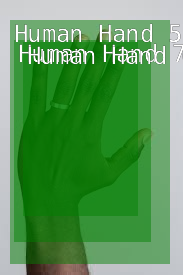

# 🎨 LiveArt

**LiveArt** is a smart assistant that detects when you're drawing and instantly boosts your workflow by auto-starting Spotify and launching a sleek local interface for music control and reference image search.

 

## 🧠 What It Does

- 🖊️ Detects when you're actively drawing (via AI/vision input or tablet use)
- 🎵 Automatically plays music from your Spotify account
- 🌐 Hosts a local website for:
  - Full Spotify control (play/pause, skip, volume, etc.)
  - Quick reference image search
  - Session visuals or future logs

## 🎬 Demo

> Watch LiveArt in action:  
[📽️ `demo.mkv`](./demo.mkv)

## 🌟 Features

- Real-time drawing detection
- One-click Spotify controls
- Integrated reference image search
- Clean local UI (runs on `localhost:5000`)
- No cloud storage – fully local and private

## 🧩 Project Structure

```
/
├── image.png # Raw input frame of hand while drawing
├── detect.png # AI-detected drawing pose frame
├── demo.mkv # Demo video showing LiveArt in action
├── app.py # Main backend Flask server
├── detector.py # Drawing detection logic (e.g. Jetson/hand tracking)
├── spotify.py # Spotify API logic
├── static/
│ └── style.css # Web styling
├── templates/
│ └── index.html # Web UI template
```


## 🔧 Requirements

- Python 3.8+
- Flask
- OpenCV or Jetson Inference (for vision)
- Spotify Developer Account (for API key)

Install with:

```bash
pip install -r requirements.txt
```

## 🚀 Usage

```
python app.py
```

Then open your browser to `http://localhost:5000`.


## 📚 Reference Image Search
Powered by:

- [Unsplash API] or [Bing Image Search API] (configurable in app.py)

## 💡 Future Ideas

- Style-based playlist switching
- Visual drawing history
- Mobile control panel

Made with ❤️ for artists who work better with vibes.